# SalesPilot：全域知识增强的大模型销售智脑


本项目是为新能源车企打造的智能销售培训助手系统，**整合RAG问答、实时Web搜索和智能Agent三大核心技术，支持本地文档知识库检索（覆盖车辆参数/配置/FAQ）、动态获取竞品对比/行业政策/用户评价，并通过个性化Agent生成针对性销售话术。**

**复现本项目，你可以学会：**

1. **掌握工业级RAG系统开发：从文档向量化、混合检索策略到生成结果优化全流程**
2. **构建实时知识更新体系：集成搜索引擎API与网页解析技术，突破大模型时效限制**
3. **开发智能决策Agent：基于React框架实现用户画像分析、多工具调度和对话记忆管理**

**本系统架构具有行业普适性，通过调整知识库和工具链即可快速应用于以下领域：**

- **金融领域：客户理财顾问系统（产品知识库+金融数据API+风控规则引擎）**
- **医疗领域：智能问诊助手（医学文献库+检查报告解析+诊疗指南Agent）**
- **教育领域：个性化学习系统（教材知识图谱+学术资源爬取+自适应推荐引擎）**
- **电商领域：智能导购机器人（商品数据库+用户评论分析+促销策略生成）**


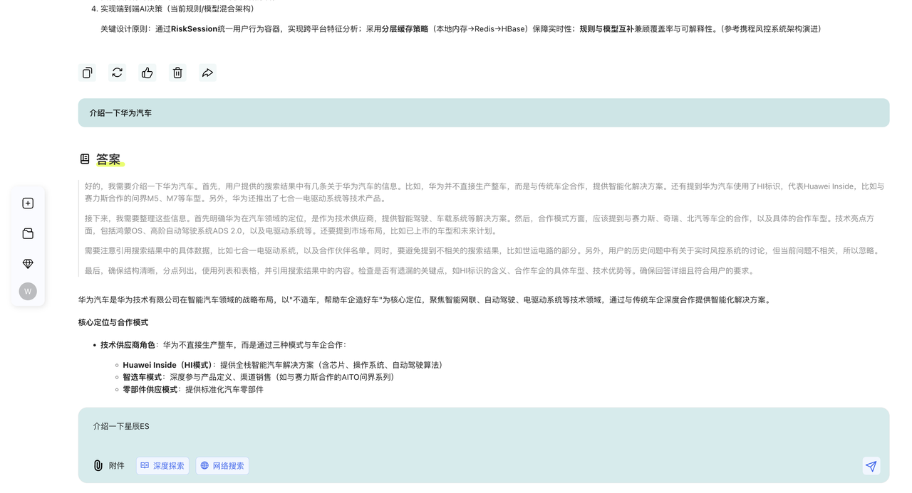


## 部署流程

### 1. 确认已经安装Docker

如果未安装，则通过官网下载：https://www.docker.com/products/docker-desktop/

### 2. 获取并配置API Key

获取大模型API Key和搜索API Key。

#### 2.1 大模型API key

本项目默认使用阿里通义大模型API  
https://www.aliyun.com/product/bailian  
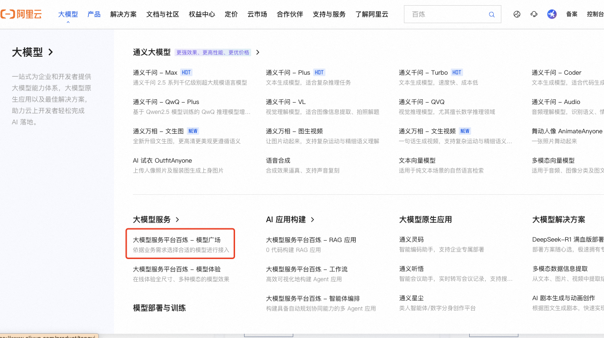
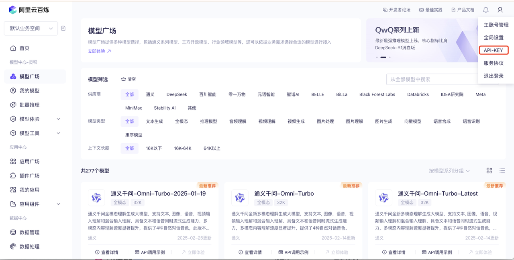
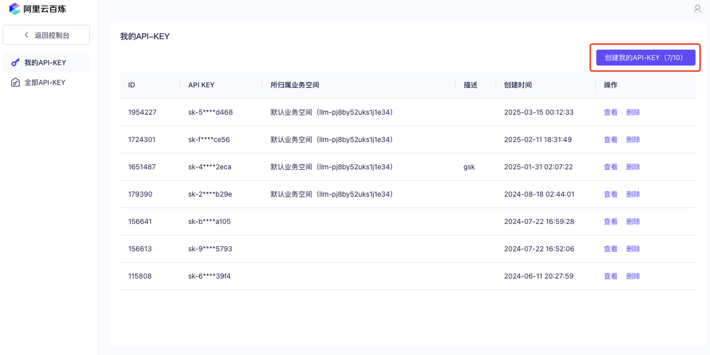

#### 2.2 搜索API key

SerperKey 是一个用于访问 Serper API 的密钥。Serper 是一个提供谷歌搜索结果的 API 工具，开发者可以通过 SerperKey 调用该工具，快速获取谷歌搜索的实时结果。  
serperkey获取网页：https://serper.dev/?utm_term=serpapi&gad_source=1&gbraid=0AAAAAo4ZGoET-Gps71A-8T3cx2guoatK-&gclid=Cj0KCQjwhYS_BhD2ARIsAJTMMQbMrcBcBbaRHzfK0P00I7yOoOQuz_KaD5g-MKZGIwNiHPhG6E9zpg8aAiAjEALw_wcB  
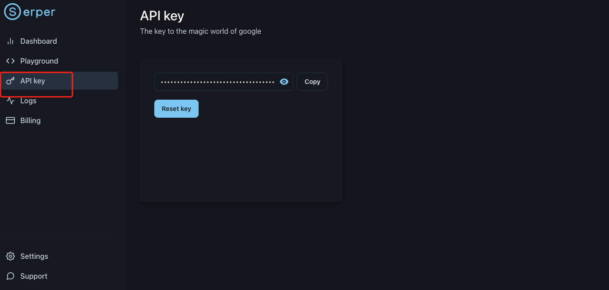
上面两个网页中获取到需要的key后，去项目代码中的.env中配置填写apikey和serperkey  
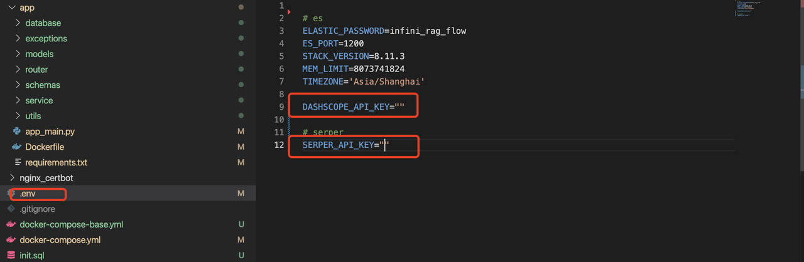

### 3. 启动后端服务

#### 方式一：Docker Compose 一键启动（推荐）

**注意：使用此方式前，请先修改 `backend/docker-compose.yml` 文件中的 NLTK 数据目录路径**

1. 进入backend目录：
   ```
   cd backend
   ```

2. 修改docker-compose.yml文件中的NLTK数据目录路径：
   ```yaml
   volumes:
     - ./app:/app/app
     - /your/nltk/data/path:/usr/local/nltk_data  # 请替换为您的NLTK数据目录路径
   ```

3. 一键启动所有服务：
   ```
   docker compose up -d --build
   ```

4. 查看服务状态：
   ```
   docker compose ps
   ```

5. 查看日志：
   ```
   docker compose logs -f ai_search
   ```

**优势：**
- 一个命令启动所有服务（PostgreSQL、Elasticsearch、AI搜索API）
- 环境隔离，避免依赖冲突
- 便于部署和扩展

#### 方式二：分步启动（开发调试）

#### 1. 启动Docker：包括了PostgreSQL和Elasticsearch服务（注意需要【合理上网】，否则连接不上）  
   先进到backend目录下，再运行以下命令： 
   ```
   docker compose -f docker-compose-base.yml up
   ```  
   如果终端出现：  
   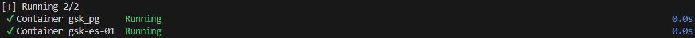
   或者检查Docker-Desktop中出现名为backend的项目且状态是绿色的，则说明启动成功  
   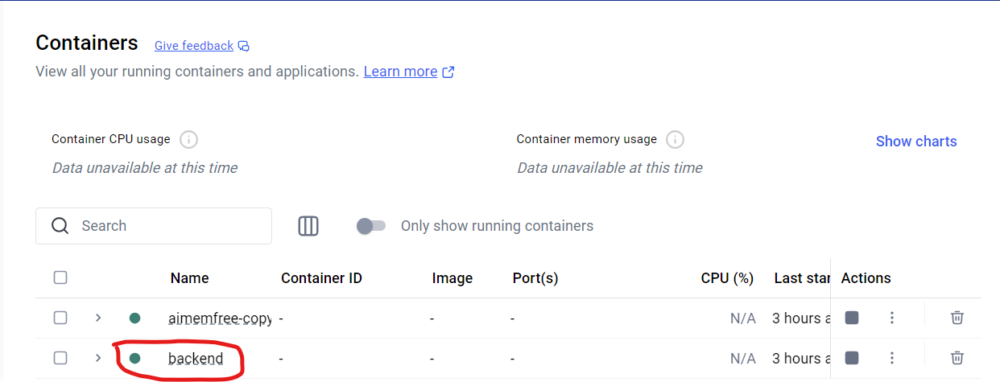

#### 2. 创建并激活虚拟环境：  
   ```
   conda create -n agent python=3.11
   conda activate agent
   ```

#### 3. 安装相应的包  
   进入app目录下，安装相应的包：
   ```
   cd app
   python -m pip install -r requirements.txt
   ```

#### 4. 启动应用服务  
   ```
   python app_main.py
   ```  
   如果输出类似下面，则说明启动成功  
   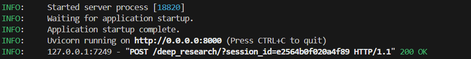
   到此为止后端服务启动成功

### 4. 启动前端服务

前面后端服务启动成功后，可能还是输出状态，建议新开一个terminal：

#### 1. 检查是否安装了Nodejs：  
   ```
   node -v
   npm -v
   ```
   如果正常输出了版本，不报错，则说明已经安装了Nodejs；若报错，则先通过官网安装：https://nodejs.org/zh-cn

#### 2. 安装前端依赖：  
   先删除版本锁文件 package-lock.json  
   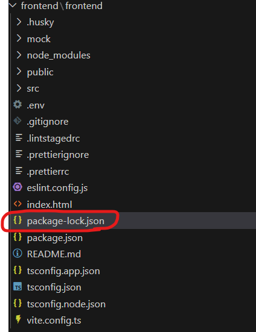
   
   到frontend目录下，安装相应依赖：
   ```
   cd frontend
   npm install
   ```

#### 4. 启动开发服务器  
   ```
   npm run dev
   ```
   出现类似下面的信息，则表示运行成功，可进入该链接体验项目：  
   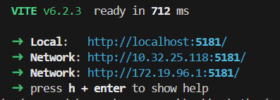
   
   如遇：Error: Cannot find module，则需要删除node_modules，再重新npm install:
   
   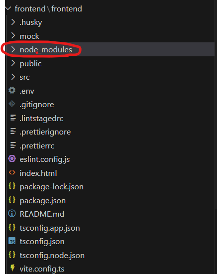  
   ctrl + click进入链接后，最终看到的项目前端页面如下：  
   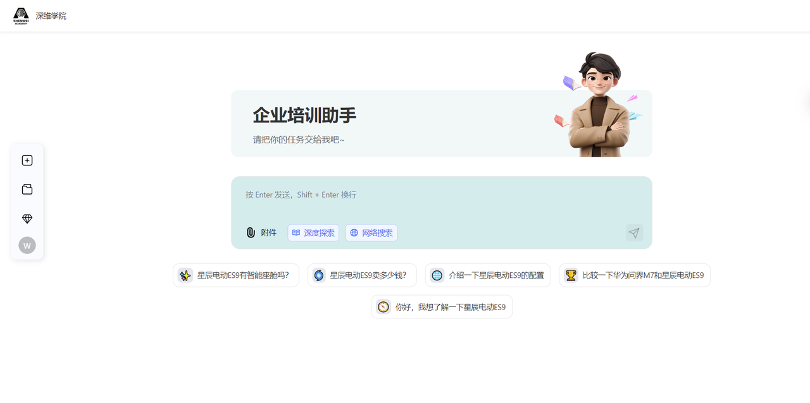
